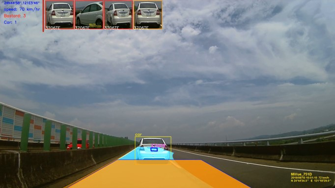

# AI_SmartCarTracking
* 我們希望完成一個自動檢舉系統, 功能含有 : 
  1. 車道偵測
  2. 車牌辨識系統  
  3. 好野人車警示系統  
  4. 強逼車與急剎車行為偵測

## Source

* main.py : 
  1. 若是需要 auto labeling all data, 可下 python main.py dataset
  2. 若是需要跑單個file,可下python main.py
  3. 在vid_pipeline的地方會蒐集, speed/經緯度/car/plate/OCR/豪車
 
```c
     test video    : ./test_video      
     output result : ./result/
```
* car_dashboard.py :
  * 畫智慧型追蹤儀表板UI的地方.
  
    
* globals.py :
  * 所有global value 放置的地方. 

* lane_detection.py : 
  1. Distortion Correction
  2. Perspective Warp
  3. Sobel Filtering
  4. Histogram Peak Detection
  5. Sliding Window Search
  6. Curve Fitting
  7. 判斷是否違規
     
* read_gps.py
  1.讀gps file, 抽出時間和車速/經緯度 

* alpr_lib.py : 
  1. car detection
  2. car category detection
  3. plate detection
  4. ocr detection
  5. car tracking

## Dataset

* 1. 違規駕駛蒐集的data set, 放在 result/data_set, Totoal 43G 2k 影片, 107個 movie file, 共268770筆資料 
* 2. 車牌資料集: AOLP dataset 共2049筆圖片 
* 3. 車子資料集: stanford car dataset + crawler 共8340筆圖片 

## References

* [單眼攝像頭測距](https://blog.csdn.net/ikoiiii/article/details/85219059)
   * code base: [https://blog.csdn.net/ikoiiii/article/details/85219059](https://blog.csdn.net/ikoiiii/article/details/85219059)
* [中文字轉語音](https://pypi.org/project/gTTS/)
   * code base:[https://pypi.org/project/gTTS/](https://pypi.org/project/gTTS/)
   * 例: tts=gTTS(text='你的右側有惡意逼車行為正在發生,系統正啟動事件錄影上傳雲端', lang='zh-tw')
   *     tts.save("carhabit01.mp3")
* [樹莓派播放語音](https://pypi.org/project/playsound/)
   * code base:[https://pypi.org/project/playsound/](https://pypi.org/project/playsound/)
   * 例: playsound.playsound('carhabit01.mp3')
   * PS.缺少特定資源python-gst-1.0,python-gst-1.0-dbg 另外安裝

* [python圖片自動爬蟲](https://github.com/YoongiKim/AutoCrawler)
 
* [谷歌批次下載圖片](https://chrome.google.com/webstore/detail/fatkun-batch-download-ima/nnjjahlikiabnchcpehcpkdeckfgnohf?hl=zh-TW)

## NOTE 
* 由於免費github帳號, 只能上傳單比小於100M的檔案, 所以我把比較大的檔案放在google drive 上, 
* https://drive.google.com/open?id=1_RPlV4hksJ6V--qOQbODavoVqjY_LMtS

```c
cp yolo-voc.weights data/vehicle-detector/yolo-voc.weights
cp yolov3.weights data/vehicle-detector/yolov3.weights
cp FILE190810-103932F.MP4 test_video/FILE190810-103932F.MP4
cp car-cat-detector.h5 data/car-cat-detector/car-cat-detector.h5
```

## Author
* Sheldon Peng (rushpeng@gmail.com)
